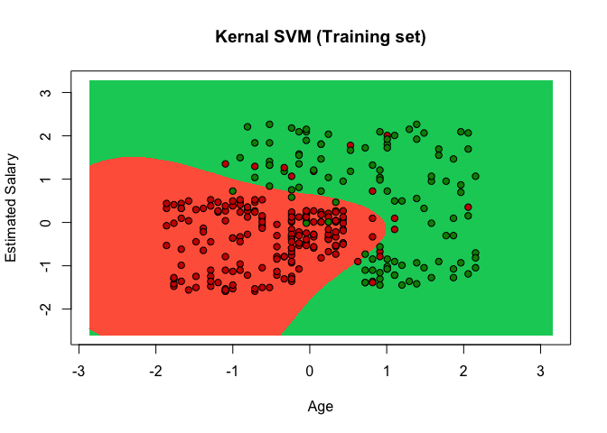
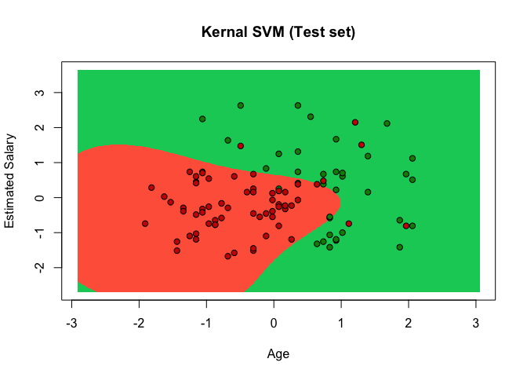

Kernal SVM (Non-Linear Classifier)
================

Information about users of a social network is provided. This social network has business clients and they put marketing ads on the social networking website. One of the business client is a car company who has recently launched a luxury car and they are going to put an ad about the newly launched car on the site. Social networking site has provided some data of users which positively responded to the ad by buying the car and negatively by not buying it.
Build a model to identify the co-relation between different variables such as Age, Estomated Salary and to predict the users who might purchase the car

``` r
# install.packages('caTools')
# install.packages('ElemStatLearn')
#install.packages('e1071')

library(caTools)
library(ElemStatLearn)
library(e1071)

# Data Preprocessing template
# Importing the dataset
setwd("/ R/ Classification/Classification/Data")
dataset = read.csv('Social_Network_Ads.csv')
dataset = dataset[,3:5] ## We will be building the model based on Age and Salary of the user

# Splitting the datas et into the Training set and Test set
set.seed(123)
split = sample.split(dataset$Purchased, SplitRatio = 0.75)
training_set = subset(dataset, split == TRUE)
test_set = subset(dataset, split == FALSE)

# Feature Scaling
training_set[, 1:2] = scale(training_set[, 1:2])
test_set[, 1:2] = scale(test_set[, 1:2])
```

``` r
## Fitting Kernal SVM to the Training set and Predict the test set result
## Using Gausian Kernel here

classifier = svm(Purchased ~ .,
                 data = training_set,
                 type = 'C-classification',
                 kernel = 'radial')

y_pred = predict(classifier, newdata = test_set[-3])
```

``` r
 #Creating confusion metrix to check how correct is our model
 # Our model predicted 90 correct and 10  wrong predictions. Total records are 100.
 
 metrix = table(test_set[, 3], y_pred)
 metrix
```

    ##    y_pred
    ##      0  1
    ##   0 58  6
    ##   1  4 32

``` r
# Visualize the training set results

set = training_set
X1 = seq(min(set[, 1]) - 1, max(set[, 1]) + 1, by = 0.01)
X2 = seq(min(set[, 2]) - 1, max(set[, 2]) + 1, by = 0.01)
grid_set = expand.grid(X1, X2)
colnames(grid_set) = c('Age', 'EstimatedSalary')
y_grid = predict(classifier,newdata = grid_set)
plot(set[, -3],
     main = 'Kernal SVM (Training set)',
     xlab = 'Age', ylab = 'Estimated Salary',
     xlim = range(X1), ylim = range(X2))
contour(X1, X2, matrix(as.numeric(y_grid), length(X1), length(X2)), add = TRUE)
points(grid_set, pch = '.', col = ifelse(y_grid == 1, 'springgreen3', 'tomato'))
points(set, pch = 21, bg = ifelse(set[, 3] == 1, 'green4', 'red3'))
```



``` r
# Visualizing test set results

set = test_set
X1 = seq(min(set[, 1]) - 1, max(set[, 1]) + 1, by = 0.01)
X2 = seq(min(set[, 2]) - 1, max(set[, 2]) + 1, by = 0.01)
grid_set = expand.grid(X1, X2)
colnames(grid_set) = c('Age', 'EstimatedSalary')
y_grid = predict(classifier,newdata = grid_set)
plot(set[, -3],
     main = 'Kernal SVM (Test set)',
     xlab = 'Age', ylab = 'Estimated Salary',
     xlim = range(X1), ylim = range(X2))
contour(X1, X2, matrix(as.numeric(y_grid), length(X1), length(X2)), add = TRUE)
points(grid_set, pch = '.', col = ifelse(y_grid == 1, 'springgreen3', 'tomato'))
points(set, pch = 21, bg = ifelse(set[, 3] == 1, 'green4', 'red3'))
```


