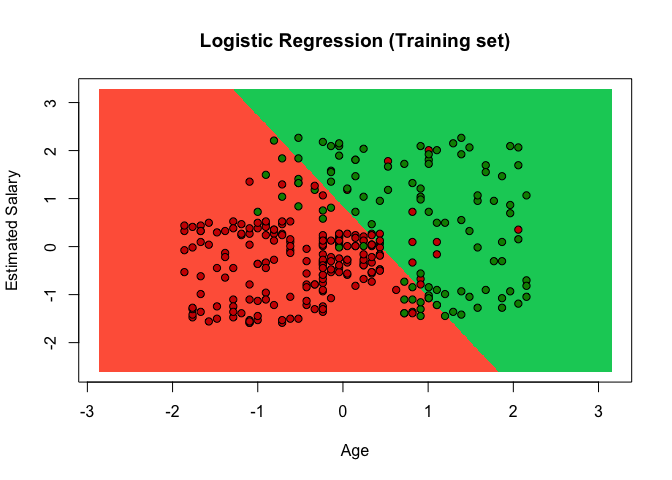
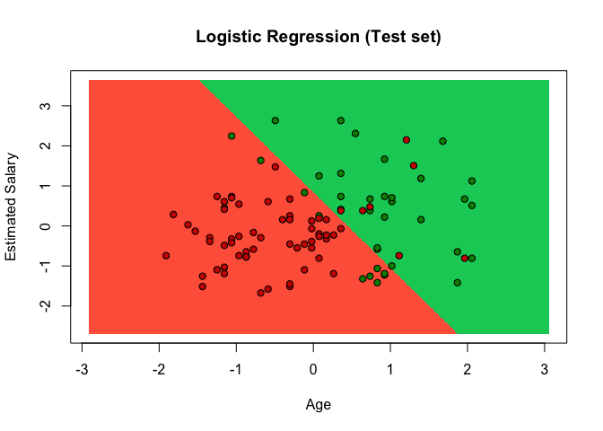

Logistic Regression (Linear Classifier)
================

Information about users of a social network is provided. This social network has business clients and they put marketing ads on the social networking website. One of the business client is a car company who has recently launched a luxury car and they are going to put an ad about the newly launched car on the site. Social networking site has provided some data of users which positively responded to the ad by buying the car and negatively by not buying it.
Build a model to identify the co-relation between different variables such as Age, Estomated Salary and to predict the users who might purchase the car

``` r
# install.packages('caTools')
# install.packages('ElemStatLearn')
library(caTools)
library(ElemStatLearn)
```

``` r
# Data Preprocessing template
# Importing the dataset
setwd("/ R/ Classification/Classification/Data")
dataset = read.csv('Social_Network_Ads.csv')
dataset = dataset[,3:5]

# Splitting the dataset into the Training set and Test set
# install.packages('caTools')
set.seed(123)
split = sample.split(dataset$Purchased, SplitRatio = 0.75)
training_set = subset(dataset, split == TRUE)
test_set = subset(dataset, split == FALSE)
# Feature Scaling
training_set[, 1:2] = scale(training_set[, 1:2])
test_set[, 1:2] = scale(test_set[, 1:2])
```

``` r
# Fitting logistic regression to the Training set
classifier = glm(formula = Purchased ~ ., 
                family = binomial,
                data = training_set)
```

``` r
# Predicting test set results using classifier we built in last step
 prob_pred = predict(classifier, type = 'response', newdata = test_set[-3])
 prob_pred
```

    ##            2            4            5            9           12 
    ## 0.0162395375 0.0117148379 0.0037846461 0.0024527456 0.0073339436 
    ##           18           19           20           22           29 
    ## 0.2061576580 0.2669935073 0.3851475689 0.5448578778 0.0103005636 
    ##           32           34           35           38           45 
    ## 0.2994922143 0.0084168787 0.0494471952 0.0171641479 0.0485051303 
    ##           46           48           52           66           69 
    ## 0.0008343060 0.0102561619 0.0007055347 0.0058448457 0.0044534947 
    ##           74           75           82           84           85 
    ## 0.3933468488 0.0071065671 0.1068589185 0.2580084947 0.0303248927 
    ##           86           87           89          103          104 
    ## 0.3303649169 0.0051132916 0.0263861849 0.1310148056 0.7649772313 
    ##          107          108          109          117          124 
    ## 0.0034367786 0.0473827096 0.0327965105 0.1626049288 0.0675494054 
    ##          126          127          131          134          139 
    ## 0.2189658514 0.4142562486 0.0324337750 0.0043457839 0.0163538708 
    ##          148          154          156          159          162 
    ## 0.1030590600 0.0751093248 0.0048556976 0.0027487256 0.0306647902 
    ##          163          170          175          176          193 
    ## 0.0463555716 0.0122981409 0.1169016711 0.0011936610 0.0103005636 
    ##          199          200          208          213          224 
    ## 0.0252589417 0.0177353905 0.9870859806 0.9453359968 0.9969454446 
    ##          226          228          229          230          234 
    ## 0.1064430571 0.9979393884 0.3705093415 0.5807527959 0.9117762840 
    ##          236          237          239          241          255 
    ## 0.7817273411 0.2310672929 0.8037996043 0.9682706714 0.6686007827 
    ##          264          265          266          273          274 
    ## 0.1451169281 0.9060311409 0.8293112410 0.9568520348 0.6781064291 
    ##          281          286          292          299          302 
    ## 0.9926955397 0.4170486388 0.9220096987 0.7363498859 0.8247736816 
    ##          305          307          310          316          324 
    ## 0.2558136823 0.9932007105 0.1178058928 0.3442845494 0.3958138650 
    ##          326          332          339          341          343 
    ## 0.3059412440 0.9725035550 0.1431602303 0.9842795480 0.2073273008 
    ##          347          353          363          364          367 
    ## 0.9371909698 0.6843940060 0.5559479117 0.5698028861 0.9440512240 
    ##          368          369          372          373          380 
    ## 0.8427877409 0.2549836305 0.9928717092 0.3243409327 0.8519685008 
    ##          383          389          392          395          400 
    ## 0.9697473704 0.3793408625 0.2718336775 0.2040229226 0.5236436275

``` r
 prediction = ifelse(prob_pred > 0.5, 1,0)
 prediction
```

    ##   2   4   5   9  12  18  19  20  22  29  32  34  35  38  45  46  48  52 
    ##   0   0   0   0   0   0   0   0   1   0   0   0   0   0   0   0   0   0 
    ##  66  69  74  75  82  84  85  86  87  89 103 104 107 108 109 117 124 126 
    ##   0   0   0   0   0   0   0   0   0   0   0   1   0   0   0   0   0   0 
    ## 127 131 134 139 148 154 156 159 162 163 170 175 176 193 199 200 208 213 
    ##   0   0   0   0   0   0   0   0   0   0   0   0   0   0   0   0   1   1 
    ## 224 226 228 229 230 234 236 237 239 241 255 264 265 266 273 274 281 286 
    ##   1   0   1   0   1   1   1   0   1   1   1   0   1   1   1   1   1   0 
    ## 292 299 302 305 307 310 316 324 326 332 339 341 343 347 353 363 364 367 
    ##   1   1   1   0   1   0   0   0   0   1   0   1   0   1   1   1   1   1 
    ## 368 369 372 373 380 383 389 392 395 400 
    ##   1   0   1   0   1   1   0   0   0   1

``` r
 #Creating confusion metrix to check how correct is our model
 # Our model predicted 83 correct and 17 wrong predictions. Total records are 100.
 
 metrix = table(test_set[, 3], prediction)
 metrix
```

    ##    prediction
    ##      0  1
    ##   0 57  7
    ##   1 10 26

``` r
# Visualize the training set results
set = training_set
X1 = seq(min(set[, 1]) - 1, max(set[, 1]) + 1, by = 0.01)
X2 = seq(min(set[, 2]) - 1, max(set[, 2]) + 1, by = 0.01)
grid_set = expand.grid(X1, X2)
colnames(grid_set) = c('Age', 'EstimatedSalary')
prob_set = predict(classifier, type = 'response', newdata = grid_set)
y_grid = ifelse(prob_set > 0.5, 1, 0)
plot(set[, -3],
     main = 'Logistic Regression (Training set)',
     xlab = 'Age', ylab = 'Estimated Salary',
     xlim = range(X1), ylim = range(X2))
contour(X1, X2, matrix(as.numeric(y_grid), length(X1), length(X2)), add = TRUE)
points(grid_set, pch = '.', col = ifelse(y_grid == 1, 'springgreen3', 'tomato'))
points(set, pch = 21, bg = ifelse(set[, 3] == 1, 'green4', 'red3'))
```



``` r
# Visualizing test set results
set = test_set
X1 = seq(min(set[, 1]) - 1, max(set[, 1]) + 1, by = 0.01)
X2 = seq(min(set[, 2]) - 1, max(set[, 2]) + 1, by = 0.01)
grid_set = expand.grid(X1, X2)
colnames(grid_set) = c('Age', 'EstimatedSalary')
prob_set = predict(classifier, type = 'response', newdata = grid_set)
y_grid = ifelse(prob_set > 0.5, 1, 0)
plot(set[, -3],
     main = 'Logistic Regression (Test set)',
     xlab = 'Age', ylab = 'Estimated Salary',
     xlim = range(X1), ylim = range(X2))
contour(X1, X2, matrix(as.numeric(y_grid), length(X1), length(X2)), add = TRUE)
points(grid_set, pch = '.', col = ifelse(y_grid == 1, 'springgreen3', 'tomato'))
points(set, pch = 21, bg = ifelse(set[, 3] == 1, 'green4', 'red3'))
```


