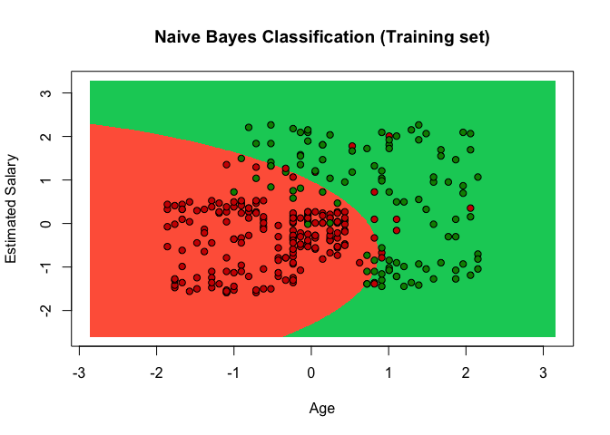
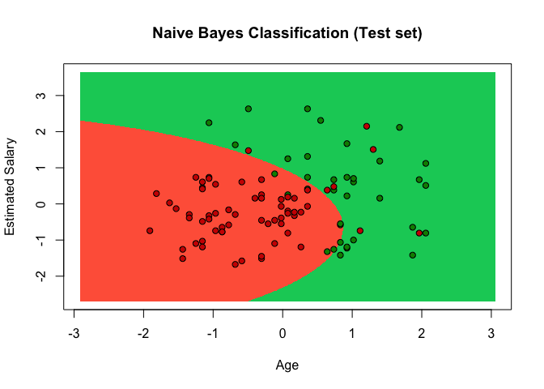

Naive Baye's Classification (Non - Linear)
================

``` r
# install.packages('caTools')
# install.packages('ElemStatLearn')
#install.packages('e1071')

library(caTools)
library(ElemStatLearn)
library(e1071)

# Data Preprocessing template
# Importing the dataset
setwd("/ R/ Classification/Classification/Data")
dataset = read.csv('Social_Network_Ads.csv')
dataset = dataset[,3:5] ## We will be building the model based on Age and Salary of the user

# Encoding the target variable as Factor
dataset$Purchased = factor(dataset$Purchased, levels = c(0,1))

# Splitting the datas et into the Training set and Test set
set.seed(123)
split = sample.split(dataset$Purchased, SplitRatio = 0.75)
training_set = subset(dataset, split == TRUE)
test_set = subset(dataset, split == FALSE)

# Feature Scaling
training_set[, 1:2] = scale(training_set[, 1:2])
test_set[, 1:2] = scale(test_set[, 1:2])
```

``` r
## Fitting Naive Bayes classifier to the Training set and Predict the test set result

classifier = naiveBayes(x = training_set[-3],
                        y = training_set$Purchased)

y_pred = predict(classifier, newdata = test_set[-3])
```

``` r
 #Creating confusion metrix to check how correct is our model
 # Our model predicted 86 correct and 14  wrong predictions. Total records are 100.
 
 metrix = table(test_set[, 3], y_pred)
 metrix
```

    ##    y_pred
    ##      0  1
    ##   0 57  7
    ##   1  7 29

``` r
# Visualize the training set results

set = training_set
X1 = seq(min(set[, 1]) - 1, max(set[, 1]) + 1, by = 0.01)
X2 = seq(min(set[, 2]) - 1, max(set[, 2]) + 1, by = 0.01)
grid_set = expand.grid(X1, X2)
colnames(grid_set) = c('Age', 'EstimatedSalary')
y_grid = predict(classifier,newdata = grid_set)
plot(set[, -3],
     main = 'Naive Bayes Classification (Training set)',
     xlab = 'Age', ylab = 'Estimated Salary',
     xlim = range(X1), ylim = range(X2))
contour(X1, X2, matrix(as.numeric(y_grid), length(X1), length(X2)), add = TRUE)
points(grid_set, pch = '.', col = ifelse(y_grid == 1, 'springgreen3', 'tomato'))
points(set, pch = 21, bg = ifelse(set[, 3] == 1, 'green4', 'red3'))
```



``` r
# Visualizing test set results

set = test_set
X1 = seq(min(set[, 1]) - 1, max(set[, 1]) + 1, by = 0.01)
X2 = seq(min(set[, 2]) - 1, max(set[, 2]) + 1, by = 0.01)
grid_set = expand.grid(X1, X2)
colnames(grid_set) = c('Age', 'EstimatedSalary')
y_grid = predict(classifier,newdata = grid_set)
plot(set[, -3],
     main = 'Naive Bayes Classification (Test set)',
     xlab = 'Age', ylab = 'Estimated Salary',
     xlim = range(X1), ylim = range(X2))
contour(X1, X2, matrix(as.numeric(y_grid), length(X1), length(X2)), add = TRUE)
points(grid_set, pch = '.', col = ifelse(y_grid == 1, 'springgreen3', 'tomato'))
points(set, pch = 21, bg = ifelse(set[, 3] == 1, 'green4', 'red3'))
```


