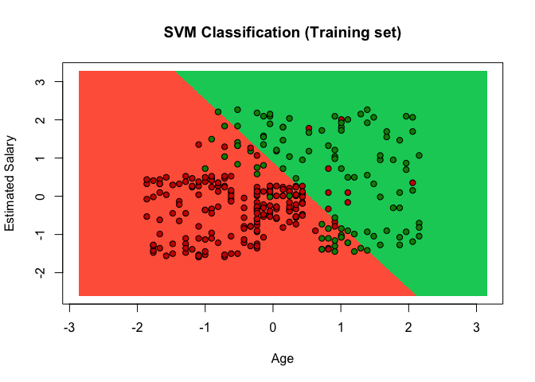
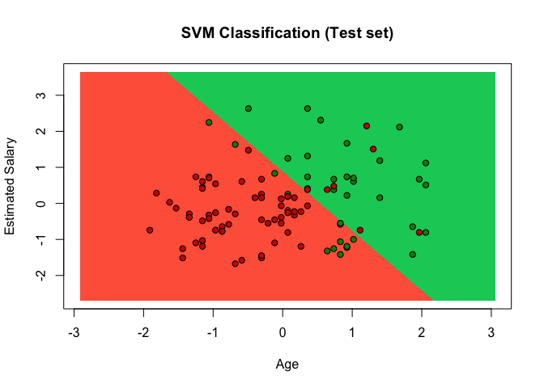

SVM Classification
================

Information about users of a social network is provided. This social network has business clients and they put marketing ads on the social networking website. One of the business client is a car company who has recently launched a luxury car and they are going to put an ad about the newly launched car on the site. Social networking site has provided some data of users which positively responded to the ad by buying the car and negatively by not buying it.
Build a model to identify the co-relation between different variables such as Age, Estomated Salary and to predict the users who might purchase the car

``` r
# install.packages('caTools')
# install.packages('ElemStatLearn')
#installed.packages('e1071')

library(caTools)
library(ElemStatLearn)
library(e1071)

# Data Preprocessing template
# Importing the dataset
setwd("/ R/ Classification/Classification/Data")
dataset = read.csv('Social_Network_Ads.csv')
dataset = dataset[,3:5] ## We will be building the model based on Age and Salary of the user

# Splitting the dataset into the Training set and Test set
set.seed(123)
split = sample.split(dataset$Purchased, SplitRatio = 0.75)
training_set = subset(dataset, split == TRUE)
test_set = subset(dataset, split == FALSE)

# Feature Scaling
training_set[, 1:2] = scale(training_set[, 1:2])
test_set[, 1:2] = scale(test_set[, 1:2])
```

``` r
## Fitting Classifier to the Training set
classifier = svm(formula = Purchased ~ .,
                 data = training_set,
                 type = 'C-classification',
                 kernel = 'linear')
```

``` r
# Predicting test set results using classifier we built in last step
 prob_pred = predict(classifier, newdata = test_set[-3])
 prob_pred
```

    ##   2   4   5   9  12  18  19  20  22  29  32  34  35  38  45  46  48  52 
    ##   0   0   0   0   0   0   0   0   0   0   0   0   0   0   0   0   0   0 
    ##  66  69  74  75  82  84  85  86  87  89 103 104 107 108 109 117 124 126 
    ##   0   0   0   0   0   0   0   0   0   0   0   1   0   0   0   0   0   0 
    ## 127 131 134 139 148 154 156 159 162 163 170 175 176 193 199 200 208 213 
    ##   0   0   0   0   0   0   0   0   0   0   0   0   0   0   0   0   1   1 
    ## 224 226 228 229 230 234 236 237 239 241 255 264 265 266 273 274 281 286 
    ##   1   0   1   0   1   1   1   0   1   1   1   0   1   1   1   1   1   0 
    ## 292 299 302 305 307 310 316 324 326 332 339 341 343 347 353 363 364 367 
    ##   1   1   1   0   1   0   0   0   0   1   0   1   0   1   1   0   1   1 
    ## 368 369 372 373 380 383 389 392 395 400 
    ##   1   0   1   0   1   1   0   0   0   0 
    ## Levels: 0 1

``` r
 #Creating confusion metrix to check how correct is our model
 metrix = table(test_set[, 3], prob_pred)
 metrix
```

    ##    prob_pred
    ##      0  1
    ##   0 57  7
    ##   1 13 23

``` r
# Visualize the training set results
set = training_set
X1 = seq(min(set[, 1]) - 1, max(set[, 1]) + 1, by = 0.01)
X2 = seq(min(set[, 2]) - 1, max(set[, 2]) + 1, by = 0.01)
grid_set = expand.grid(X1, X2)
colnames(grid_set) = c('Age', 'EstimatedSalary')
prob_set = predict(classifier, newdata = grid_set)
plot(set[, -3],
     main = 'SVM Classification (Training set)',
     xlab = 'Age', ylab = 'Estimated Salary',
     xlim = range(X1), ylim = range(X2))
contour(X1, X2, matrix(as.numeric(prob_set), length(X1), length(X2)), add = TRUE)
points(grid_set, pch = '.', col = ifelse(prob_set == 1, 'springgreen3', 'tomato'))
points(set, pch = 21, bg = ifelse(set[, 3] == 1, 'green4', 'red3'))
```



``` r
# Visualizing test set results

set = test_set
X1 = seq(min(set[, 1]) - 1, max(set[, 1]) + 1, by = 0.01)
X2 = seq(min(set[, 2]) - 1, max(set[, 2]) + 1, by = 0.01)
grid_set = expand.grid(X1, X2)
colnames(grid_set) = c('Age', 'EstimatedSalary')
prob_set = predict(classifier, type = 'response', newdata = grid_set)
plot(set[, -3],
     main = 'SVM Classification (Test set)',
     xlab = 'Age', ylab = 'Estimated Salary',
     xlim = range(X1), ylim = range(X2))
contour(X1, X2, matrix(as.numeric(prob_set), length(X1), length(X2)), add = TRUE)
points(grid_set, pch = '.', col = ifelse(prob_set == 1, 'springgreen3', 'tomato'))
points(set, pch = 21, bg = ifelse(set[, 3] == 1, 'green4', 'red3'))
```


